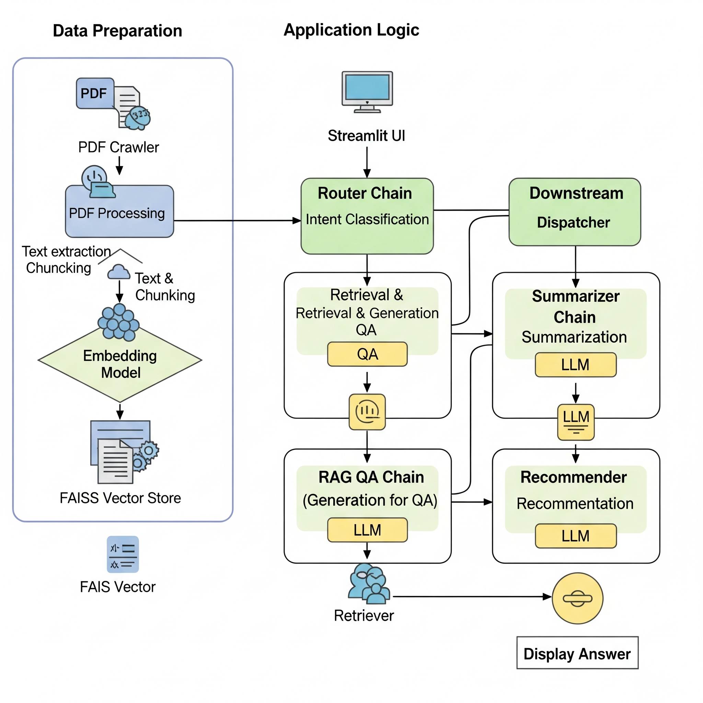

# 프로젝트 이름

<br>

## 💻 프로젝트 소개
### <프로젝트 소개>
- 이 프로젝트는 LangChain을 기반으로 한 기업 리포트 QA(Question Answering) 시스템입니다. 사용자가 기업 리포트에 대해 질문하면, 시스템이 해당 내용을 이해하고 답변을 제공합니다.

### <작품 소개>
- streamlit을 활용하여 사용자가 쉽게 기업 리포트에 대한 질문을 할 수 있는 웹 애플리케이션입니다.

<br>

## 👨‍👩‍👦‍👦 팀 구성원

|  |  |  |  |  |
| :--------------------------------------------------------------: | :--------------------------------------------------------------: | :--------------------------------------------------------------: | :--------------------------------------------------------------: | :--------------------------------------------------------------: |
|            [김주형](https://github.com/UpstageAILab)             |            [진정](https://github.com/UpstageAILab)             |            [최지희](https://github.com/UpstageAILab)             |            [이진식](https://github.com/UpstageAILab)             |            [소재목](https://github.com/UpstageAILab)             |
|                            팀장, 베이스라인 코드 모듈화 및 ui 개발                             |                            리포트 QA 시스템 개발 역할                             |                            Router Chain 개발                             |                            크롤링으로 자료 수집 및 전처리                           |                            리포트 QA 시스템 개발                             |

<br>

## 🔨 개발 환경 및 기술 스택
- 주 언어 : python
- 버전 및 이슈관리 : github
- 협업 툴 : github, notion
- 주요 라이브러리:
    - langchain: LLM 기반 애플리케이션 개발 프레임워크
    - streamlit: 웹 애플리케이션 개발
    - faiss-cpu: 벡터 스토어
    - langchain-upstage, langchain-openai: LLM 및 임베딩 모델 연동

<br>

## 📁 프로젝트 구조
```
├── src
│   ├── config
│   │   ├── __init__.py
│   │   ├── models.py
│   │   └── settings.py
│   ├── core
│   │   ├── __init__.py
│   │   ├── document_processor.py
│   │   ├── downstream_chains.py
│   │   ├── llm_manager.py
│   │   ├── qa_chain.py
│   │   ├── router_chain.py
│   │   └── vector_store.py
│   ├── crawlers
│   │   └── crawling.py
│   ├── prompts
│   │   ├── base.jinja
│   │   ├── qa_memory_prompt.jinja
│   │   └── qa_prompt.jinja
│   ├── tools
│   │   ├── __init__.py
│   │   └── company_compare.py
│   ├── utils
│   │   ├── __init__.py
│   │   ├── file_utils.py
│   │   ├── prompt_utils.py
│   │   └── text_utils.py
│   ├── app.py
│   └── main.py
├── .env.example
├── .gitignore
├── README.md
├── requirements.txt
└── vectorstoring.py
```

<br>

## 💻​ 구현 기능
### 기능1: 기업 리포트 기반 질의응답 (QA)
- 사용자가 기업 리포트와 관련된 질문을 하면, LangChain의 RAG(Retrieval-Augmented Generation) 기술을 활용하여 정확한 답변을 제공합니다.

### 기능2: 채팅 기록 관리
- 사용자와의 대화 내용을 기억하여 이전 대화 내용을 기반으로 답변을 제공합니다.

### 기능3: 인텐트 라우팅
- 사용자의 질문 의도를 '질의응답', '요약', '추천', '일반 대화' 등으로 분류하여 각 의도에 맞는 기능을 수행합니다.

<br>

## 🛠️ 작품 아키텍처(필수X)
- #### gemini로 만든 이미지라서 오타가 있을 수 있습니다.


<br>

## 🚨​ 트러블 슈팅
### 1. OpenAI RateLimitError 에러 발견

### 오류 설명
- 벡터 스토어를 업데이트하는 과정에서 OpenAI의 RateLimitError가 발생했습니다. 이는 짧은 시간 동안 너무 많은 요청을 보내 OpenAI의 API 제한에 도달했기 때문입니다.

### 해결
- 이 문제를 해결하기 위해 지수 백오프(exponential backoff) 재시도 로직을 구현했습니다. 오류가 발생하면, 대기 시간을 점차 늘려가며 최대 5번까지 재시도합니다. 이를 통해 API 요청을 조절하여 오류를 해결했습니다.

<br>

## 📌 프로젝트 회고
- 이번 프로젝트를 통해 LangChain과 LLM을 활용한 QA 시스템 개발의 전반적인 과정을 경험할 수 있었습니다. 특히, RAG 기술을 실제로 구현해보면서 그 원리를 깊이 이해하게 되었습니다. 또한, Streamlit을 사용하여 빠르게 프로토타입을 만들고 사용자 친화적인 인터페이스를 구축하는 능력을 기를 수 있었습니다.

<br>

## 📰​ 참고자료
- [LangChain 공식 문서](https://python.langchain.com/docs/introduction/)

- [Streamlit 공식 문서](https://docs.streamlit.io/)

- [Upstage AI Lab](https://www.upstage.ai/)
